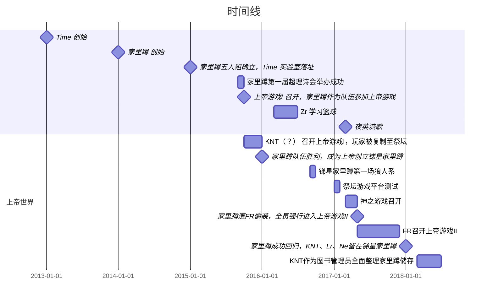

## 时间线

|年份|“现实”世界|人物|对应作品|上帝世界|人物|对应作品|
|:-:|:-:|:-:|:-:|:-:|:-:|:-:|
|2013|Time 创始|Sr, Fr| | | | 
|2014|家里蹲 创始|Fr, Sr, Sb, Ds| | | | 
|2015|家里蹲五人組确立，Time 实验室落址|Fr, Sr, Zr, Sb, Ds| | | |
| |冢里蹲第一届超理诗会举办成功|Fr, Sr, Sb, Ds|《诗与尺规作图-诗之章》| | | 
| |上帝游戏I 召开，家里蹲作为队伍参加上帝游戏|Fr, Sr, Zr, Sb, Ds, Lr, KNT| 《前前传》|KNT（？） 召开上帝游戏I，玩家被复制至祭坛|Fr, Sr, Zr, Sb, Ds, Lr, KNT |《前前传》
|2016| | | |家里蹲队伍胜利，成为上帝创立锑星家里蹲|Fr, Sr, Zr, Sb, Ds| 
| |Zr 学习篮球|Zr, 白哥, Fr, Sr, Ne |《Zr的校园言情故事》|锑星家里蹲第一场狼人系|Fr, Sr, Zr, Sb, Ds, Lr, Ne等18人|《狼人杀番外》
|2017| | | |祭坛游戏平台测试|Fr, Sr, Ds, 等等|《诗与尺规作图-几何之章》
| |夜英流歌|楚夜歌|《夜英流歌》|神之游戏召开|Fr, Sr, Zr, Sb, Ds, KNT, Ne, FR|《前传：上》
| | | | |家里蹲遭FR偷袭，全员强行进入上帝游戏II| |《前传：下》
| | | | |FR召开上帝游戏II| |《正传：上帝游戏》
|2018| | | |家里蹲成功回归，KNT、Lr、Ne留在锑星家里蹲| |《正传：上帝游戏》
| | | | |KNT作为图书管理员全面整理家里蹲储存|KNT, Fr, Sr, Zr, Sb, Ds, Lr, Ne|《Zr 的篮球》

## 世界观

都太监了还哪来的世界观……更何况本质上是大型同人……

正传的架构，引用[前传结尾](https://h1su.github.io/long/2016-08-16-qianzhuanjiewei/)这段吧

>Sr: 
>
>关于宇宙编号的问题
>
>前传设定：整个游戏一共由36个葡萄组成（36天罡，看玄幻的朋友你可以这样理解）
>
>编号分别为：
>
>1（总宇宙，直连真理祭坛）
>
>2（I战区总）3 （II战区总）4（III战区总） 5（IV战区总）
>
>（I战区*7）6 7 8 9 10 11 12
>
>（I战区*7）13 14 15 16 17 18 19
>
>（I战区*7）20 21 22 23 24 25 26
>
>（I战区*7）27 28 29 30 31 32 33
>
>（备用1） 34（先被FR占为办公室）
>
>（备用2）35（复联所处）
>
>（备用3）36（BM又发现&KNT发信）
>
>所以，所谓的13号就是2.1战队的巨棋盘

---

